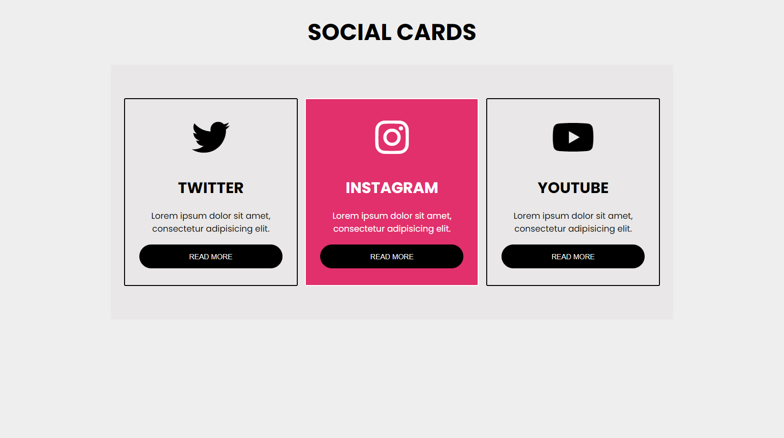

# Responsive Social Cards Project

This is a simple project aimed at practicing HTML and CSS skills, particularly focusing on responsiveness. The project consists of cards created using HTML and styled using CSS. Each card features social icons for Twitter, Instagram, and YouTube, along with a short text and a button.


## Technology Used ⚡

**Programming Language:** HTML5, CSS3

**Tools:** Visual Studio Code
## Installation 🔌


Clone my repository

```bash
 git clone https://github.com/ahmadaimandev/Social-Cards.git
```

## Screenshots 🖼

<p align="center">
  
</p>

## Guidance 📚

- [W3School](https://www.w3schools.com/)
- [ChatGPT](https://chat.openai.com/)

## License 📃

This project is licensed under the MIT License. 

## Contributing

Contributions are welcome! Feel free to submit a pull request or open an issue to discuss any changes.